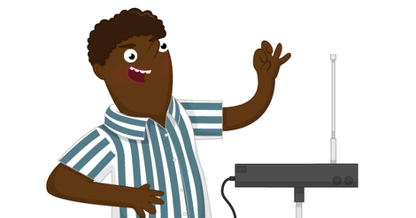

## What next?

You could have your UDS turn on an [LED](https://projects.raspberrypi.org/en/projects/rpi-LED){:target="_blank"}  when something gets close, or use it to sound a [Buzzer](https://projects.raspberrypi.org/en/projects/rpi-buzzer){:target="_blank"}!

If you are looking for a longer project that uses PIRs, you could try the [Ultrasonic Theremin](https://projects.raspberrypi.org/en/projects/ultrasonic-theremin){:target="_blank"} project. In this project, you will use a Raspberry Pi and a UDS to make a sci-fi style musical instrument called a Theremin! 

A theremin is a unique musical instrument: it produces sound without being touched by the performer. The circuitry for a theremin is fairly complicated, but you can use ultrasonic distance sensors to fake it!

